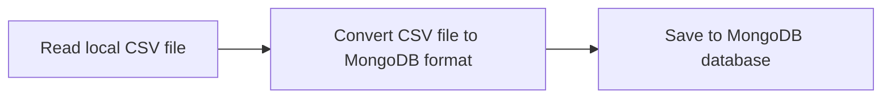
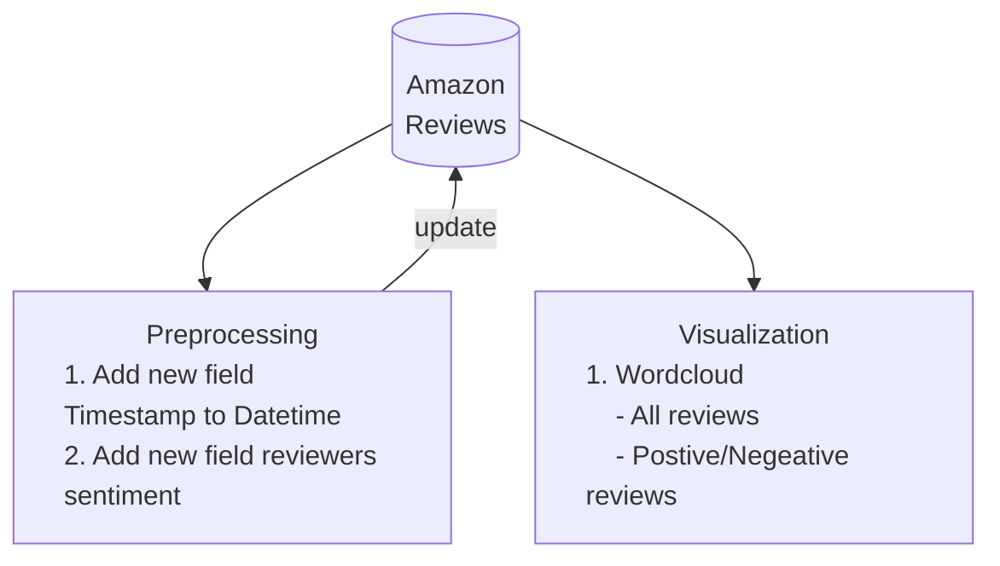
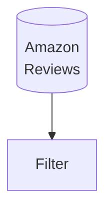

# **NTUST - BDA**

## **Flow Chart**

### CSV to MongoDB


### Preprocssing & Analysis



### Helpfulness predict



✅ TODO
- [ ] Wordcloud
   - [ ] Different sentiment

```yaml
.
├── 01_load_data_into_mongodb.py
├── 02_query_mongo_create_fields.py
├── Dockerfile # for docker
├── Makefile
├── README.md
├── Reviews_withURL.csv
├── compose-dev.yaml # for docker
└── requirements.txt # for python
```